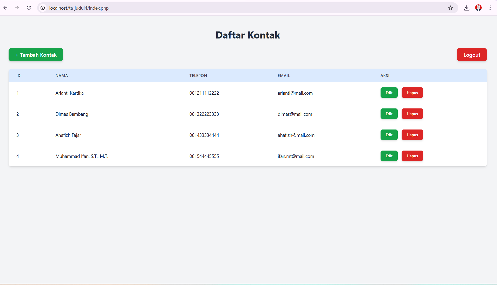

# Sistem Manajemen Kontak (PHP & Tailwind CSS)

Proyek ini dibuat untuk menyelesaikan **Tugas Akhir Judul 4 Praktikum Pemrograman Web**.

**Oleh:**
* **Nama:** Arianti Kartika Dewi
* **NPM:** 2315061047
* **Kelas:** PPW-B

---

Proyek ini adalah aplikasi web CRUD (Create, Read, Update, Delete) sederhana untuk manajemen kontak. Aplikasi ini dibangun murni menggunakan **PHP** dan **Tailwind CSS** (via CDN).

Aplikasi ini tidak memerlukan *database* (seperti MySQL) karena semua data kontak disimpan sementara di dalam **PHP Session**.

## 📸 Tampilan Aplikasi

Berikut adalah tampilan dari halaman utama daftar kontak:



## ✨ Fitur Utama

* **Autentikasi Pengguna:** Halaman login sederhana untuk melindungi data.
* **Create:** Menambah data kontak baru (Nama, Telepon, Email).
* **Read:** Menampilkan semua data kontak dalam tabel yang rapi.
* **Update:** Mengedit data kontak yang sudah ada.
* **Delete:** Menghapus data kontak.
* **Penyimpanan Data:** Menggunakan **PHP Session** untuk menyimpan data selama sesi *browser* aktif.
* **Desain:** Tampilan modern menggunakan **Tailwind CSS** (via CDN).

## 💻 Teknologi yang Digunakan

* **PHP:** Sebagai bahasa *backend* utama.
* **HTML5:** Untuk struktur halaman.
* **Tailwind CSS:** Untuk *styling* dan desain (dimuat melalui CDN).

## 🚀 Cara Menjalankan Proyek

1.  Pastikan Anda memiliki *web server* lokal yang menjalankan PHP (contoh: **XAMPP**, **MAMP**, atau **WAMP**).
2.  Clone atau unduh repositori ini.
3.  Pindahkan seluruh folder proyek (`ta-judul4`) ke dalam direktori `htdocs` (untuk XAMPP) atau `www` (untuk MAMP/WAMP) di server lokal Anda.
4.  Jalankan server Apache Anda melalui panel kontrol XAMPP/MAMP.
5.  Buka *browser* Anda dan navigasi ke:
    ```
    http://localhost/ta-judul4/
    ```
6.  Anda akan otomatis diarahkan ke halaman `login.php`.

## 🔑 Kredensial Login

Gunakan kredensial berikut untuk masuk ke dalam sistem:

* **Username:** `admin`
* **Password:** `123`

*(Kredensial ini di-hardcode di dalam file `login.php`).*
